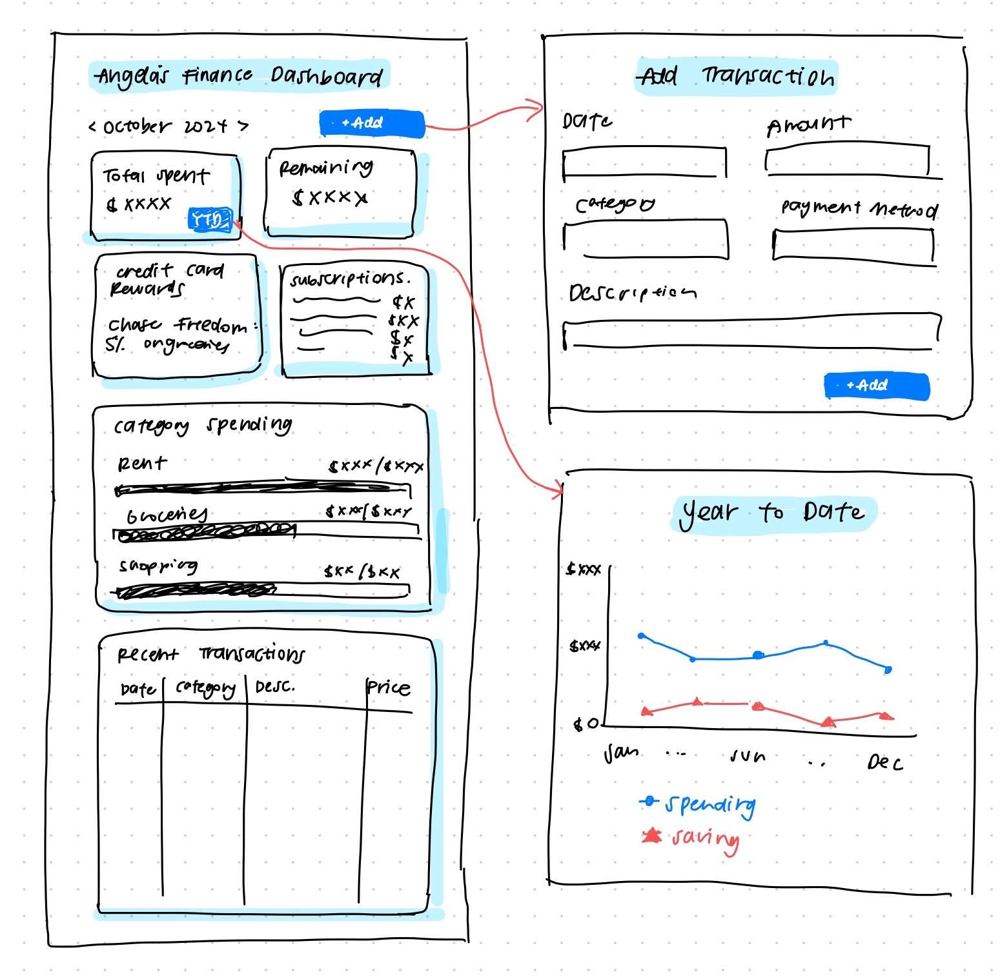

<mark>**Note that this document order from FP4 -> FP1**</mark>

<mark>Please sign up for the study</mark> at [https://tinyurl.com/pui-study](https://tinyurl.com/pui-study) to allow us to use your submission to create a better GenAI assistant for designers!

---

# **FP4 \- Final Project Writeup**

Feel free to refer to this [Markdown Cheat Sheet](https://www.markdownguide.org/cheat-sheet/) to make your writeup more organized, and you can preview your markdown file in VSCode [Markdown editing with Visual Studio Code](https://code.visualstudio.com/docs/languages/markdown#_markdown-preview). 

## Part 1: Website Description

Describe your website (300 words).

* What is the purpose of your website?   
* Who is the target audience?  
* What information do you convey with your website?   
* How is it interesting and engaging? 

## Part 2: User Interaction

How a user would interact with your website? For each step, briefly but clearly state the interaction type & how we should reproduce it.

1. Interaction type. Click on X on page Y / scroll on page X, etc.  
2. 

## Part 3: External Tool

Describe what important external tool you used (JavaScript library, Web API, animations, or other). Following the bulleted list format below, reply to each of the prompts.

1. Name of tool1  
   * Why did you choose to use it over other alternatives? (2 sentences max)  
   * How you used it? (2 sentences max)  
   * What does it add to your website? (2 sentences max)  
2. Name of tool2

## Part 4: Design Iteration

Describe how you iterated on your prototypes, if at all, including any changes you made to your original design while you were implementing your website and the rationale for the changes. (4-8 sentences max)

## Part 5: Implementation Challenge

What challenges did you experience in implementing your website? (2-4 sentences max)

## Part 6: Generative AI Use and Reflection

Describe how you used Generative AI tools to create this final project (fill in the following information, write \~500 words in total).

Document your use of all GenAI tools — ChatGPT, Copilot, Claude, Cursor, etc. using the template below. Add/Delete rows or bullet points if needed, and replace Tool1/Tool2 with the name of the tool.

### Usage Experiences by Project Aspects

Feel free to edit the column \_ (other?) or add more columns if there's any other aspect in your project you've used the GenAI tools for.

For the following aspects of your project, edit the corresponding table cell to answer:
- *Usage*: Whether you used / did not use this tool for the aspect. Enter [Yes/No]
- *Productivity*: Give a rating on whether this tool makes your productivity for X aspect [1-Much Reduced, 2-Reduced, 3-Slightly Reduced, 4-Not Reduced nor Improved, 5-Slightly Improved, 6-Improved, 7-Much Improved].

| Tool Name | Ratings | design | plan | write code | debug | \_ (other?) |
| :---- | :---- | :---- | :---- | :---- | :---- | :---- |
| Tool1 | Usage | Yes/No | Yes/No | Yes/No | Yes/No | Yes/No |
| Tool1 | Productivity | 1~7 | 1~7 | 1~7 | 1~7 | 1~7 |
| Tool2| Usage | Yes/No | Yes/No | Yes/No | Yes/No | Yes/No |
| Tool2 | Productivity | 1~7 | 1~7 | 1~7 | 1~7 | 1~7 |

### Usage Reflection

> Impact on your design and plan 
* It matched my expectations and plan in [FP2](#generative-ai-use-plan) in that … For example, 
  1. Tool1: 
  2. Tool2:
* It did not match my expectations and plan in [FP2](#generative-ai-use-plan) in that … For example, 
  1. Tool1: 
  2. Tool2:
* GenAI tool did/did not influence my final design and implementation plan because … For example, 
  1. Tool1: 
  2. Tool2:

> Use patterns
* I accepted the generations when …  For example, 
  1. Tool1: this tool once suggested … and I adjusted my design according to the suggestion because … 
  2. Tool2: 
* I critiqued/evaluated the generated suggestions by … For example, 
  1. Tool1: this tool once suggested … but I modified/rejected the suggestion because … 
  2. Tool2: 

> Pros and cons of using GenAI tools
* Pros
  1. Tool1: 
  2. Tool2:
* Cons
  1. Tool1: 
  2. Tool2:

### Usage Log

Document the usage logs (prompts and chat history links) for the GenAI tools you used. Some tools may not have an easy way to share usage logs, just try your best! Some instructions for different tools:

1. [ChatGPT](https://help.openai.com/en/articles/7925741-chatgpt-shared-links-faq) / [Gemini](https://support.google.com/gemini/answer/13743730?hl=en&co=GENIE.Platform%3DDesktop): share the anonymous link to all of your chat histories relevant to this project
2. [GitHub Copilot (VSCode)](https://code.visualstudio.com/docs/copilot/copilot-chat#:~:text=You%20can%20export%20all%20prompts%20and%20responses%20for%20a%20chat%20session%20in%20a%20JSON%20file%20with%20the%20Chat%3A%20Export%20Session...%20command%20(workbench.action.chat.export)%20in%20the%20Command%20Palette.): export chat histories relevant to this project.

---

# **FP3 \- Final Project Check-in**

Document the changes and progress of your project. How have you followed or changed your implementation & GenAI use plan and why? Remember to commit your code to save your progress.

## Implementation Plan Updates

- [ ] ...

## Generative AI Use Plan Updates

- [ ] ...

Remember to keep track of your prompts and usage for [FP4 writeup](#part-6-generative-ai-use-and-reflection).

---

# **FP2 \- Evaluation of the Final project**

## Project Description

I’m creating Eat Shanghai, a digital preservation of my family recipes from Shanghai to make these recipes accessible and engaging for future generations in my family. I’ll incorporate elements of my family’s history, images from our home kitchen, and hand-drawn illustrations to add to the homemade charm.

## High-Fi Prototypes

### *Prototype 1: Home Page*

This is the landing page for Eat Shanghai, which is the users' first impressions of the site and their access point for all of the different recipes available on the site. My evaluators gave me a few key recommendations, including adding a header to the recipe section, adding a footer to the site overall, and incorporating more interactive elements (like animated chopsticks and sparkling effects). They also wanted more obvious signaling for clickable areas and recommended that I achieve this through adding labels to each dish.

### *Prototype 2*

This is the Pork Wontons Recipe Page, which shows images, ingredients, and instructions for the dish. The rest of the recipe pages will follow a similar format. My evaluators suggested both content and visual refinements for this page. One evaluator mentioned that the placement of the opening copy feels awkward. They also mentioned how the main image shouldn't cut off content. Additionally, they said the page lacks visual interest and suggested adding process photos and incorporating the hand-drawn illustration style from the homepage. Overall, the page needs more elements to maintain consistency with the homepage's design language.

## Usability Test

For the usability testing that I conducted, I had two evaluators use the think aloud protocol to give me feedback on my designs. I had each of my evaluators complete three tasks during their respective tests.

1. Browse the home screen and identify what actions you should be able to take here. Scroll and click around to explore the interactions.
2. Navigate to the Pork Wontons recipe page.
3. Browse the Pork Wontons recipe page and identify what actions you should be able to take here.

Through this protocol, I received really helpful feedback that I implemented into the second version of my designs. For better navigation and visual clarity, I lightened the color of the chopsticks and added labels to each of the dishes on the homepage. Additionally, I added a footer to help users better understand when there is no more page content and it's no longer scrollable.

On the recipe pages, my evaluators gave me some helpful feedback on the visual design, which is something I was struggling with when I was creating the design. For example, I made a few enhancements by incorporating step-by-step photos for the wonton-making process. Additionally, I adjusted image sizing and used custom cropping for better visual integration into the site. I also took their advice of adding hand-drawn illustrations to maintain consistent design language throughout the site. Another change I made was implementing a servings adjustment feature for ingredients to improve user functionality. Now, users can toggle through 1x, 2x, and 3x, ingredient options.

In the actual implementation of the site, I will add audio guidance for the process steps to add an additional layer of interactivity. I chose to implement these changes that they suggested to address my evaluator's concerns about navigation clarity, visual storytelling, and interactivity while preserving my site's visual design.

## Updated Designs

Homepage updated with labels for each dish and a footer.

Wontons recipe page updated with custom image cropping, hand drawn visuals, process images, and an ingredients serving size adjuster.

## Feedback Summary

During lab today, I received more helpful feedback, and the following are the most helpful pieces of feedback that I will implement in my final designs. In terms of visual design and navigation, someone mentioned that the overall look and feel of the site authentically reflects my own style. They recommended that I should consider showing partial recipe content ("peek through") to indicate scrollable content. On the recipes page, someone said to explore different image shapes in the process images to maintain some visual interest, and to add in some hand drawn icons throughout the instructions as well. A key piece of feedback I got was to consider how people think while cooking and structure my content accordingly. For example, in terms of the recipe page layout and functionality, someone suggested that I should make the ingredients section sticky during scrolling so that people can easily reference the list when they are scrolling through the instructions. They also mentioned that I could make a better use of the white space under the ingredients section, and to improve readability by increasing the spacing between each process step in the instructions. I could also consider breaking down the steps into main steps with substeps, and use bold text for important phrases. This could help users with their ability to scan the instructions quickly.

In terms of technical recommendations, I was told to use WEBP format images for better web performance and accessibility. For heading hierarchy, I can use the text "Recipes by the Xuans" for my H1 text to make sure that it is accessible. I could also consider using overlapping rows using relative/absolute positioning, and using D3 for animations to achieve the visual designs I'm going for.
In general, I was advised to focus on the basic functionality of my site before adding too many animations so that I can stay on track with timing.

## Milestones

### *Implementation Plan*

- [x]  Week 9 Oct 28 - Nov 1:
    - [x]  FP1 due
- [ ]  Week 10 Nov 4 - Nov 8:
    - [x]  FP2 due
    - [ ]  Create hi-fi prototypes for the other 4 recipe pages, and for mobile
    - [ ]  Complete basic HTML/CSS for home page, with a format that can be achieved with CSS flex boxes
        - [ ]  Consider breakpoints and responsiveness for mobile
- [ ]  Week 11 Nov 11 - Nov 15:
    - [ ]  Implement first recipe page (wontons)
        - [ ]  Consider breakpoints and responsiveness for mobile
    - [ ]  Implement sticky ingredients feature
    - [ ]  Familiarize with GSAP
- [ ]  Week 12 Nov 18 - Nov 22:
    - [ ]  Complete 2 more recipe pages
    - [ ]  GSAP animations for homepage: Chopsticks animations, sparkle effects
- [ ]  Week 13 Nov 25 - Nov 29:
    - [ ]  Complete final 2 recipe pages
    - [ ]  Polish homepage to be more decorative
    - [ ]  Thanksgiving
- [ ]  Week 14 Dec 2 - Dec 6:
    - [ ]  FP4 due
    - [ ]  Continue polishing homepage
    - [ ]  Gen AI documentation
    - [ ]  Final polish and submission

### *Libraries and Other Components*

List the JS libraries and other components (if applicable) that you plan to use. 
* GSAP animation library

## Generative AI Use Plan

I plan to leverage a different Generative AI tools strategically while maintaining the very personal nature of my project. 

### *Tool Use*

 What would you use? Edit the list given your plan. For each tool, explain briefly on what do you expect Generative AI to help you with and what might it not be able to help you with.

- Claude
    - I mainly use Claude in my workflow, and I think  Claude will be particularly helpful for two key aspects: writing copy and learning GSAP.
    - For copy, I'll use Claude to help refine recipe instructions to make sure they're clear and concise while maintaining my family's voice.
    - I'll also use it to help me with the About Page copy. Since I'm new to the GSAP animations library, Claude can provide code examples and explain implementation approaches for what I am trying to achieve.
- Microsoft Copilot can help me with generating placeholder images during development before I replace them with my own food photography.

There are crucial aspects where I will not rely on AI. The visual design elements - including illustrations, layout decisions, and overall aesthetic - need to remain deeply personal to reflect my family's story and my design style. These creative decisions will come from me to maintain the authentic connection to my family's culinary heritage.

### *Responsible Use*

How would you use Generative AI responsibly? 
To use AI responsibly, I will:

- Always review and understand generated code before implementation
- Use AI as a learning tool, not just a solution provider
- Maintain transparency about which parts were AI-assisted and document my chat history
- Verify technical suggestions against documentation and make sure I'm understanding them
- Keep the personal narrative and design vision driven by own personal style
- Use AI to enhance, not replace, my creative decision-making

The goal is to let AI handle more mechanical aspects (like writing copy and generating images) while I focus on the creative and personal elements that make Eat Shanghai unique. I think this approach will help me build a technically solid website while preserving the authentic, family-centered essence of the effect I am trying to achieve.

---

# **FP1 \- Proposal for Critique**

## Idea Sketches

### *Personal Portfolio*

My goal is to create a personal portfolio that communicates who I am as a designer and a person. I want to convey my design approach, technical and soft skills, and personal interests and values. I will use P5 for features such as Alpha Mask to make my portfolio visually engaging. Additionally, I will make it interactive through project thumbnails that reveal details on hover, marquee animations, custom cursor interactions, and scrolling animations. I’ll make it accessible through clear navigation structure, alt text for images, high contrast color options, and more.

### *Shanghai Family Recipes*

I want to create a digital preservation of family recipes from Shanghai to make these recipes accessible and engaging for future generations in my family. I’ll make it interactive through filtering options by ingredient, occasion, or difficulty, and a dynamic service size calculator. To make it accessible, I will ensure screen reader compatibility, clear typography, multiple language support, and clear alt text.

### *Personal Finance Tracker*

My goal is to create a customizable financial tracking system that combines spending tracking and categorization, credit card reward optimization, and yearly/monthly overviews in one dashboard. It will be interactive through dynamic spending visualizations, real-time category spending bars, and adding new transactions. I’ll make sure my data tables are accessible, the charts are color-blind friendly, and that there are consistent navigation patterns.

## Feedback Summary

In today’s lab critique session for FP1, I received many helpful pieces of feedback from my peers. I focused on getting feedback on my ideas of a Shanghai family recipe catalog and a personal finance tracker because those are the ideas I was the most excited about.

My Shanghai family recipe catalog received the most extensive feedback. Technical recommendations I received include implementing a filtering system that allows users to select more than one filter option at a time, and considering various ways to display measurement formats to accommodate the imprecise nature of family recipes. Design suggestions included emphasizing the homey, personal feel of family recipes through hand-drawn elements. Ideas for more interactivity included incorporating 3D icons with hover animations and process photos demonstrating important visual cues in cooking like the color and consistency of the food. A unique suggestion I received involved incorporating audio recording of family members to capture the word-of-mouth aspect of recipe sharing amongst my family. 

For my personal finance tracker concept, someone suggested that I make sure it is accessible through mobile so that I can log transactions on the go. Additionally, I was told that Vega-Lite would be better suited for my purposes as opposed to D3, because Vega-Lite is built upon D3. I could also consider using SQL for backend data management. Lastly, someone told me to make sure that I’m considering all of the use cases I want for my personal experience, so that I don’t run into any functionality blockers as I’m using it.

My third idea was for a personal portfolio, but my TA suggested that there are other platforms out there for portfolio building that would make this easier, so I have decided against the idea. The key piece of feedback I got for this idea was to avoid generic approaches and make sure my individual character shows through. Additionally, it would be important for me to consider mobile-friendly functionality because recruiters and hiring managers may be looking at my portfolio on their phones.

## Feedback Digestion

I’ll focus on my ideas of a Shanghai family recipe catalog and a personal finance tracker because I've narrowed down my ideas to those two.

In general, I received feedback to think about what I would gain from adding each of these projects to my portfolio. Someone got me thinking about how these are going to benefit me as a product designer, and what I want to convey to future employers. I think the Shanghai family recipes catalog would show more of my visual design skills, whereas the personal finance tracker would show more of my programming and data visualization skills. This piece of feedback will be critical in my selection.

In regards to my recipe catalog idea, I would incorporate the feedback to select just a few recipes to start with first, instead of trying to incorporate all of my ideas. This is because one of my main concerns was that I wouldn’t be able to achieve the visual design I wanted with the time constraints I have, so I think this is good advice. Another suggestion I would incorporate is to make the website feel homey using hand drawn illustrations and a well thought-out color scheme. Someone suggested that I should have 3D thumbnails for each dish, but I will deprioritize this as it could detract from the core functionality and extend development time significantly. An idea that I’ll consider based on feasibility with my family members’ time is to record their audio to incorporate into the recipes. I would record them in Chinese and then transcribe them and translate them to English.

For my personal finance tracker, I’ll incorporate the idea of using Vega-lite instead of D3 because it is better suited for my purposes. Additionally, I don’t think it’s completely necessary for me to have a complete SQL backend – for the initial version, a simpler data management system might be more appropriate. I will also consider scaling some of the widgets down to make sure I have enough time to complete the assignment.
